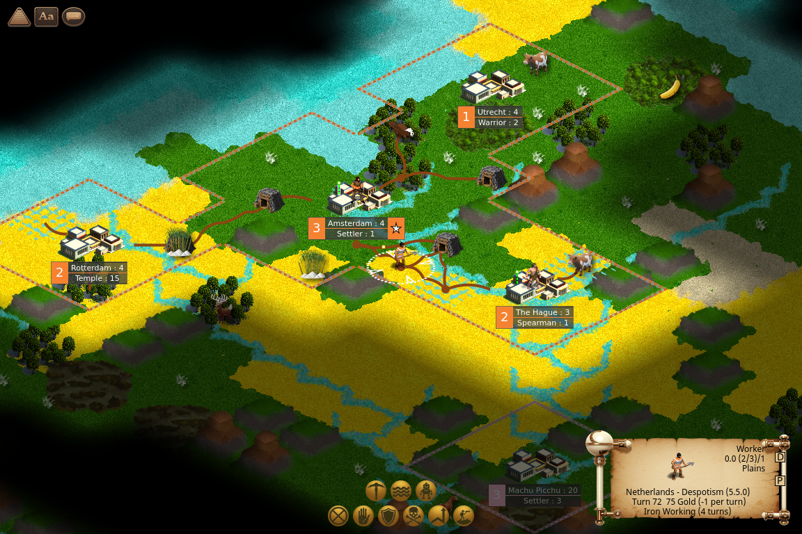
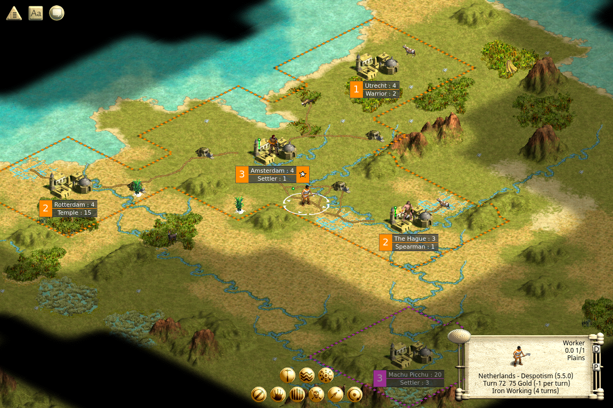

# OpenCiv3

**OpenCiv3** (formerly known by the codename "C7") is an open-source, cross-platform, mod-oriented, modernized reimagining of _Civilization III_ by the fan community built with the Godot Engine and C#, with capabilities inspired by the best of the 4X genre and lessons learned from modding Civ3. Our vision is to make Civ3 as it could have been, rebuilt for today's modders and players: removing arbitary limits, fixing broken features, expanding mod capabilities, and supporting modern graphics and platforms. A game that can go beyond C3C but retain all of its gameplay and content.

***OpenCiv3 is under active development and currently in an early pre-alpha state.*** It is a rudimentary playable game but lacking many mechanics and late-game content, and errors are likely. Keep up with our development for the latest updates and opportunities to contribute!

### [New Players Start Here: An Introduction to OpenCiv3 at CivFanatics](https://forums.civfanatics.com/threads/welcome-to-openciv3-new-players-start-here.674451/)

## Connect with the community

- **[CivFanatics subforum](https://forums.civfanatics.com/forums/civ3-future-development.604/)**
- **[Discord](https://discord.gg/uwxUuWhM89)**
- **[GitHub](https://github.com/C7-Game/Prototype)**

> NOTE:
> OpenCiv3 is not affiliated with civfanatics.com,
> Firaxis Games, BreakAway Games, Hasbro Interactive, Infogrames Interactive,
> Atari Interactive, or Take-Two Interactive Software.
> All trademarks are property of their respective owners.

# Get OpenCiv3 "Dutch"

## December 2025: v0.3 Dutch Preview 1 Has Been Released!

The OpenCiv3 team is pleased to announce the first preview release of the v0.3 "Dutch" milestone.  This is a major enhancement over the "Carthage" release, and our debut with standalone mode featuring placeholder graphics without the need for Civ3 media files. A local installation of Civ3 is still recommended for a more polished experience. See the [release notes](https://github.com/C7-Game/Prototype/releases/) for a full list of new features in each version.

 

_OpenCiv3 Dutch Preview 1 with the same game in Standalone mode (top) and with imported Civ3 graphics (bottom)_

## Download

Download the appropriate zip file for your OS from **[the Dutch Preview 1 release](https://github.com/C7-Game/Prototype/releases/tag/v0.3-dutch-preview-1)**

All official releases of OpenCiv3 along with more detailed release notes can be found on the [GitHub releases page.](https://github.com/C7-Game/Prototype/releases/)

## Install

### System Requirements

- 64-bit Windows, Linux, or Mac OS. Other platforms may be supported in future releases.
- Minimum hardware requirements have not yet been identified. Please let us know if OpenCiv3 does not perform well on your system.
- Recommended: A local copy of _Civilization III_ files (the game itself does NOT have to run) from _Conquests_ or the _Complete_ edition. Standalone mode is available with placeholder graphics for those who do not have a copy.
  - _Civilization III Complete_ is available for a pittance from [Steam](https://store.steampowered.com/app/3910/Sid_Meiers_Civilization_III_Complete/) or [GOG](https://www.gog.com/en/game/sid_meiers_civilization_iii_complete)

### Windows Installation

This is a Windows 64-bit executable. OpenCiv3 will look for a local installation of _Civilization III_ in the Windows registry automatically, or you may use an environment variable to point to the files.

- Download and extract the zip file
- Double-click `OpenCiv3.exe`
- If it is blocked, you may need to unblock it by
  - Right click
  - Click on Properties
  - Check the "Unblock" checkbox near the bottom buttons in the "Security" section
  - Click OK
- If your _Civilization III_ installation is not detected, you can set the environment variable `CIV3_HOME` pointing to it and restart OpenCiv3

### Linux Installation

This is an x86-64 Linux executable. You may use an environment variable to point to the files from a _Civilization III_ installation. You can just copy or mount the top-level "Sid Meier's Civilization III Complete" (Sans "Complete" if your install was from pre-Complete CDs) folder and its contents to your Linux system, or install the game via Steam or GOG.

- Download and extract the tgz file
- Set the `CIV3_HOME` environment variable to point to the Civ3 files, e.g. `export CIV3_HOME="/path/to/civ3"`
- From that same terminal where you set `CIV3_HOME`, run `OpenCiv3.x86_64`
- To make this variable permanent, add it to your `.profile` or equivalent.

### Mac Installation

This is a universal 64-bit executable, so it should run on both Intel and M1 Macs. You may use an environment variable to point to the files from a _Civilization III_ installation. You can just copy or mount the top-level "Sid Meier's Civilization III Complete" (Sans "Complete" if your install was from pre-Complete CDs) folder and its contents to your Mac system, or install the game via Steam or GOG.

- Download the zip; it may complain bitterly, and you may have to tell it to keep the download instead of trashing it
- Double click the zip file, and a folder with `OpenCiv3.app` and a json file will appear
- If you try to open `OpenCiv3.app` it will tell you it's damaged and try to trash it; it is not damaged
- To unblock the downloaded app, from a terminal run `xattr -cr /path/to/OpenCiv3.app`; you can avoid typing the path out by typing `xattr -cr ` and then dragging the `OpenCiv3.app` icon onto the terminal window
- Set the `CIV3_HOME` environment variable to point to the Civ3 files, e.g. `export CIV3_HOME="/path/to/civ3"`
- From that same terminal where you set `CIV3_HOME`, run `OpenCiv3.app` with `open /path/to/OpenCiv3.app`, or again just type `open ` and drag the OpenCiv3 icon onto the terminal window and press enter

## Known issues

- OpenCiv3 uses many primitive placeholder assets; loading files from a local _Civilization III_ install is recommended (see platform specific setup instructions above)
- Support for playing Civ3 BIQ or SAV files is incomplete; some files will not load correctly and crashes may occur
- For Mac:
  - Mac will try hard not to let you run this; it will tell you the app is damaged and can't be opened and helpfully offer to trash it for you. From a terminal you can `xattr -cr /path/to/OpenCiv3.app` to enable running it.
  - Mac will crash if you hit buttons to start a new game (New Game, Quick Start, Tutorial, or Load Scenario) because it cant find our 'new game' save file we're using as a stand-in for map generation. But you can Load Game and load `c7-static-map-save.json` or open a Civ3 SAV file to open that map
- Other specific bugs will be tracked on the [GitHub issues page.](https://github.com/C7-Game/Prototype/issues?q=is%3Aissue%20state%3Aopen%20label%3Abug)

> © OpenCiv3 contributors. OpenCiv3 is free and open source software released under the [MIT License](https://opensource.org/license/mit).
